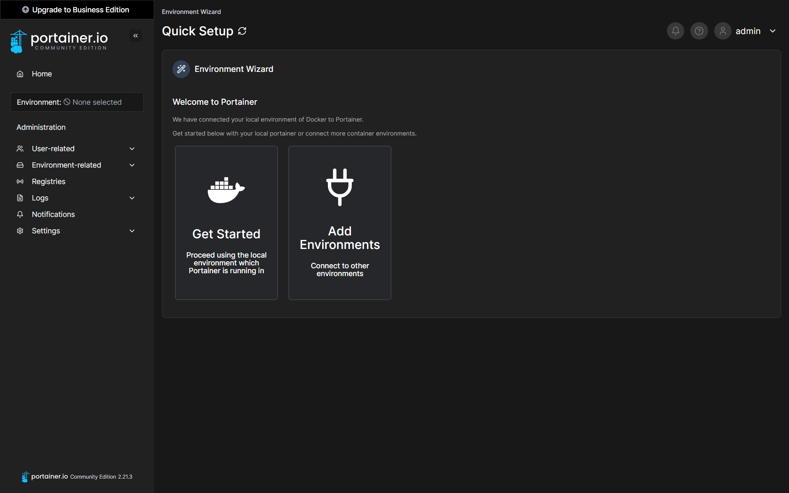

+++
title = 'How to install Portainer CE on Ubuntu using Docker'
date = 2024-10-09
lastmod = 2024-10-09
draft = false
series = ["ubuntu server"]
author = "arbs09"
description = "You want to optimize your docker Workflow? With Portainer you can simplify the management of your Docker containers."
keywords = [
    "How to install Portainer on Docker",
    "Docker",
    "Portainer",
    "How to install Portainer on Ubuntu",
]
tags = [
    "ubuntu",
    "Docker",
    "Linux",
]
+++

## Requirements

You need a Linux Sever / Computer with Docker installed.

## Installation of Portainer on Ubuntu using Docker

### Creating a volume

```bash
sudo docker volume create portainer_data
```

This is where Portainer will store the data.

### Creating the Container

```bash
sudo docker run -d -p 8000:8000 -p 9443:9443 --name portainer --restart=always -v /var/run/docker.sock:/var/run/docker.sock -v portainer_data:/data portainer/portainer-ce:latest
```

This created a instance of Portainer CE as a Docker Container.

### Setting Portainer up

First you got to

```bash
<your server ip>:9443
```

It should look like this:


Here you can create the your user account for Portainer.

Now it should look like this



Here you can choose "Get Started".


Now now have Portainer CE set up.

## More Info

If you want to know more you can check out the Portainer Dokumentation under [docs.portainer.io](https://docs.portainer.io/).
